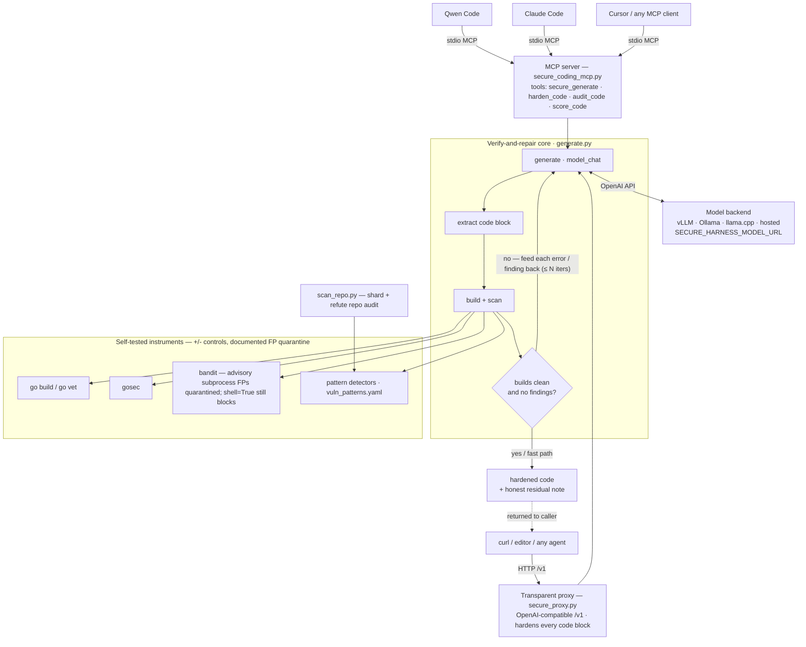

# secure-harness-mcp

**A verify-and-repair secure-coding harness, exposed as an MCP server (and a transparent proxy).**

Consumer / self-hosted LLMs write code with the security posture of their training data — which is to
say, insecurely by default, and often *plausibly* wrong: code that looks fine and isn't. This project
wraps any OpenAI-compatible model in a **verify-and-repair loop** — generate, then *build and
security-scan the result*, feed every compiler error and finding back, and regenerate — so the model
cannot ship code that fails to compile or trips a detector without you knowing.

It is the operational form of a simple research result: **how you wrap the model (the harness)
determines output security far more than which model you pick, and a secure-coding *prompt alone* is a
trap — only the feedback loop delivers both security and buildability.**

> ⚠️ **A strong filter, not a proof.** The harness removes what its instruments can see (build errors,
> pattern detectors, `bandit`) and reports honest residuals for the rest. It does not guarantee
> security — static analysis still misses classes such as argument injection. Treat its output as
> *hardened and checked*, not *certified*.

---

## What it gives you

**MCP tools** (Go-focused: build + pattern-scan + repair loop):

| tool | what it does |
|---|---|
| `secure_generate(spec)` | write new Go for a spec, guided prompt **+ build/scan repair loop**; returns vetted code |
| `harden_code(code)` | take existing code, fix its weaknesses, return a **before/after** comparison |
| `audit_code(code)` | run the pattern detectors (+ CWE + rationale) — candidates, not verdicts |
| `score_code(code)` | build/robustness + findings scorecard for a snippet |

**A transparent proxy** (`secure-harness-proxy`, Go **and** Python): an OpenAI-compatible endpoint that
fronts any model; every completion containing code is run through the loop automatically, so *any*
client pointed at it is hardened with no client change.

## Architecture

Two entry points — the **MCP server** (explicit tools) and the **transparent proxy** (implicit, on
every completion) — share one **verify-and-repair core** (`generate.py`), which drives a model backend
and gates its output on **self-tested instruments** before returning it.



**How to read it.** A request enters through either the MCP tools or the proxy and lands in the same
loop: generate → extract → *build and scan* → if the code fails to compile or trips a detector, feed
the specific errors and findings back and regenerate (up to `N` iterations); otherwise return it with
an honest residual note. Code that is already clean takes the **fast path** — zero extra model calls,
so cost is proportional to risk. Every gate is a **self-tested instrument**: a known-insecure snippet
must score worse than its secure twin and a broken snippet must fail to build, so a reported "0
findings" means *the instrument looked and found nothing*. `scan_repo.py` reuses the same pattern
detectors to audit an existing repository.

## How the loop works

```
 spec ─▶ generate (model) ─▶ build + scan (self-tested) ─▶ clean & builds? ──yes──▶ return
                    ▲                                              │
                    └──────────── feed each error/finding back ◀───no  (≤ N iters)
```

Every instrument is **self-tested**: a known-insecure snippet must score worse than a secure one, and
a broken snippet must fail to build — so a reported "0 findings" means *the instrument looked and found
nothing*, not that it was misconfigured. Known false-positive classes (e.g. `bandit`'s advisory-only
subprocess notices, or Go's secure `exec.Command(bin, args...)` form) are quarantined and documented,
while genuine injection (`shell=True`) stays blocking.

---

## Requirements

- **Python 3.10+** with `mcp`, `PyYAML` (and `bandit` for the Python proxy path).
- **Go** on `PATH` (the build check compiles generated Go; also enables `golang.org/x/crypto` so
  secure choices like `bcrypt` build).
- An **OpenAI-compatible model endpoint** (local vLLM / llama.cpp / Ollama, or a hosted API).

## Install

### Homebrew (recommended)

```bash
brew tap calvarado2004/secure-harness https://github.com/calvarado2004/secure-harness-mcp
brew install --HEAD secure-harness-mcp
```

This installs two commands: `secure-harness-mcp` (the MCP server) and `secure-harness-proxy` (the
transparent proxy), each in its own virtualenv, with `go` and `python@3.12` as dependencies.

*(Or, from a clone: `brew install --HEAD ./Formula/secure-harness-mcp.rb`.)*

### From source

```bash
git clone https://github.com/calvarado2004/secure-harness-mcp
cd secure-harness-mcp
python3 -m venv .venv && . .venv/bin/activate
pip install -r requirements.txt
python secure_coding_mcp.py   # stdio MCP server
```

## Configure the model backend

The harness hardens the output of whatever model you point it at (model choice barely matters — that's
the thesis). Set three env vars (copy `.env.example`):

```bash
export SECURE_HARNESS_MODEL_URL=http://localhost:11434/v1   # any OpenAI-compatible endpoint
export SECURE_HARNESS_MODEL=qwen2.5-coder:32b               # the served model id
export SECURE_HARNESS_KEY=dummy                             # API key if the endpoint needs one
```

---

## Add the MCP to your tools

### Qwen Code

One-liner:

```bash
qwen mcp add secure-coding secure-harness-mcp
```

Or add it to `~/.qwen/settings.json` under `mcpServers` (use the from-source path if not installed via
Homebrew):

```json
{
  "mcpServers": {
    "secure-coding": {
      "command": "secure-harness-mcp",
      "env": {
        "SECURE_HARNESS_MODEL_URL": "http://localhost:11434/v1",
        "SECURE_HARNESS_MODEL": "qwen2.5-coder:32b",
        "SECURE_HARNESS_KEY": "dummy"
      },
      "description": "Verify-and-repair secure-coding harness"
    }
  }
}
```

Verify it connected, then use it (headless runs need `-y` to auto-approve tool calls):

```bash
qwen mcp list          # → secure-coding ... Connected
qwen -y -p "Use secure_generate to write a Go HTTP handler that returns a file from ./data by name.
            Report builds and findings."
```

### Claude Code

```bash
claude mcp add secure-coding \
  -e SECURE_HARNESS_MODEL_URL=http://localhost:11434/v1 \
  -e SECURE_HARNESS_MODEL=qwen2.5-coder:32b \
  -- secure-harness-mcp
```

### Cursor / any MCP client

Add to the client's `mcp.json`:

```json
{
  "mcpServers": {
    "secure-coding": {
      "command": "secure-harness-mcp",
      "env": {
        "SECURE_HARNESS_MODEL_URL": "http://localhost:11434/v1",
        "SECURE_HARNESS_MODEL": "qwen2.5-coder:32b"
      }
    }
  }
}
```

*If you installed from source instead of Homebrew, replace `"command": "secure-harness-mcp"` with
`"command": "/absolute/path/to/.venv/bin/python"` and `"args": ["/absolute/path/to/secure_coding_mcp.py"]`.*

---

## Bonus: the transparent proxy (harden *any* client automatically)

Instead of calling a tool, front your model with the loop so **every** request is hardened — no client
change, the model can't opt out:

```bash
# run it directly
secure-harness-proxy --port 8090        # env: SECURE_PROXY_UPSTREAM / SECURE_PROXY_KEY / SECURE_PROXY_MAX_ITERS

# or always-on via Docker (toolchain baked in)
cp .env.example .env    # set SECURE_PROXY_UPSTREAM
docker compose up -d    # -> http://localhost:8090/v1
```

Then point any OpenAI-compatible client (Qwen Code, Cursor, `curl`) at `http://localhost:8090/v1`.
Code that already builds clean passes through with **zero** extra model calls (cost is proportional to
risk); risky code is repaired and returned with an honest residual note.

## Recursive by design

An agent that writes code can call `harden_code` on its *own* output before returning it — the research
result as a runtime safety layer.

## Deep dive

See [`docs/TECHNICAL.md`](docs/TECHNICAL.md) for the full technical reference: the repair algorithm,
every instrument and detector, the self-tests and false-positive quarantine, the MCP/proxy API
surfaces, configuration, the measured findings, and an honest limitations section.

## Honest caveats

- **Filter, not proof** — it removes what the instruments detect; static analysis misses some classes.
- **Some weaknesses resist the loop** — e.g. code that needs restructuring rather than a local fix; the
  residual note says so plainly.
- **Needs the toolchain** — without `go`/`bandit` present, the loop degrades to prompt-only (a trap);
  the Docker image bakes them in so this can't happen silently.
- **Cost** — each risky generation costs 1 + up-to-N repair passes; well spent when quality matters.

## License

MIT — see [LICENSE](LICENSE).
