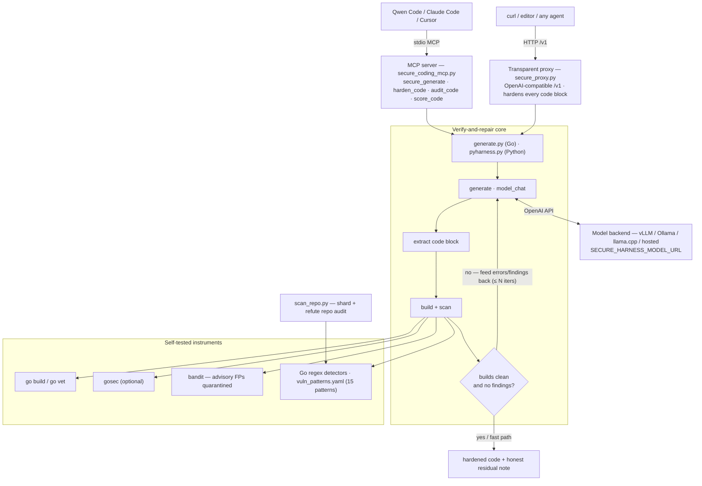

# secure-harness-mcp — Technical Reference

**A verify-and-repair secure-coding harness, exposed as an MCP server and a transparent
OpenAI-compatible proxy.** This document is the deep technical companion to the top-level
[README](../README.md) and to the research paper *"Closing the Security Gap: A Verify-and-Repair
Harness Lets Consumer LLMs Approach Frontier-Grade Secure Code."* It describes the architecture,
every instrument, the exact repair algorithm, the deployment surfaces, the measured findings, and —
deliberately — the known limitations, so the numbers can be trusted for what they are and not for
what they are not.

---

## Table of contents

1. [Thesis in one paragraph](#1-thesis-in-one-paragraph)
2. [System architecture](#2-system-architecture)
3. [The verify-and-repair loop](#3-the-verify-and-repair-loop)
4. [Instruments (the security & robustness oracles)](#4-instruments)
5. [Self-tests and false-positive quarantine](#5-self-tests-and-false-positive-quarantine)
6. [MCP server surface](#6-mcp-server-surface)
7. [Transparent proxy surface](#7-transparent-proxy-surface)
8. [Configuration & deployment](#8-configuration--deployment)
9. [Experimental findings](#9-experimental-findings)
10. [Methodology & known limitations](#10-methodology--known-limitations)
11. [Reproducibility](#11-reproducibility)
12. [File map](#12-file-map)

---

## 1. Thesis in one paragraph

Consumer language models — the kind that fit on a desktop workstation — write code insecurely by
default, and the same code often *looks* correct. Rather than buy a larger model (a frontier model
needs a rack-scale, ~$250K, 8-GPU server), we wrap a cheap locally-served model in a **verify-and-repair
loop**: generate → *build and security-scan the result* → feed every compiler error and detector
finding back → regenerate, up to *N* passes. Empirically this cuts the vulnerability density of
generated code by **82–100%** while preserving buildability, at the cost of a few extra generation
attempts — bringing a **~$5,000 four-GPU workstation** (4× RTX A4000, ~64 GB VRAM) to within a few
percentage points of a frontier reference model. The engineering claim of this repo is that the loop
is a *runtime* layer, not a one-off study: it ships as an MCP tool and as an inference proxy that any
OpenAI-compatible client can sit behind.

> **On "comparable size":** the two subject models are treated as comparable because they impose a
> comparable *memory footprint* on consumer hardware — both nearly fill 64 GB of VRAM when served.
> Whether one is a mixture-of-experts (DiffusionGemma, ~3.8 B active) and the other dense
> (Qwen3.6-27B, 27 B active) is immaterial to the deployment question this project asks: *what does it
> cost to run locally?* — and the answer is the same.

---

## 2. System architecture

Two entry points share one core. The **MCP server** (`secure_coding_mcp.py`) exposes explicit tools;
the **transparent proxy** (`secure_proxy.py`) hardens *every* completion implicitly. Both call the
**verify-and-repair core** (`generate.py` for Go, `pyharness.py` for Python), which drives an
OpenAI-compatible model backend and gates output on **self-tested instruments** (`scan_repo.py` +
`vuln_patterns.yaml` for Go, `bandit` for Python, `gosec` optional).



### Design invariants

- **The model cannot opt out.** In the proxy path the loop lives in the serving path, not in the
  client, so no prompt or client setting can bypass it.
- **Cost is proportional to risk.** Code that already builds clean takes a *fast path* — zero extra
  model calls (`harden_content` short-circuits when the first assessment is clean).
- **A reported "0 findings" is earned, not assumed.** Every instrument carries a positive/negative
  self-test that must pass before it is trusted (§5).
- **Honest residuals.** When the loop cannot fully clean the code, it says so, naming the residual
  CWEs, rather than silently returning something that looks fine.

---

## 3. The verify-and-repair loop

### 3.1 The three experimental conditions

The research pipeline holds the task fixed and varies only *how the model is wrapped*:

| condition | what it is | in code |
|---|---|---|
| `baseline` | neutral prompt, no security guidance | `BASELINE_SYS` |
| `guided` | secure-coding system prompt injected (the harness as a *better prompt*) | `secure_system_prompt.txt` / `py_secure_prompt.txt` |
| `guided_repair` | guided **plus** the build+scan+feedback loop (the harness as a *feedback loop*) | `repair()` |

The scientific contrast is `guided` vs `guided_repair`: it isolates the value of the **loop** from the
value of the **instruction**, at fixed model and fixed task.

### 3.2 The algorithm (Go, `generate.py`; Python is the mirror in `pyharness.py`)

```
generate(spec):
    code = extract_code(model_chat(secure_system_prompt, spec))   # 1 model call
    if condition == guided_repair:
        for _ in range(N):                    # N = repair_iters (MCP default 2, study default 1–2)
            ok, build_err, findings = build_and_scan(code)
            if ok and not findings:
                break                         # converged — stop early
            problems = compiler_errors(build_err) + scanner_findings(findings)
            code = extract_code(model_chat(     # regenerate against SPECIFIC feedback, temp 0.2
                secure_system_prompt,
                spec + "your previous solution had problems: " + problems +
                "return a corrected version that compiles and resolves every issue"))
    return code
```

Key implementation details:

- **`model_chat`** (`generate.py:36`) posts to `{BASE_URL}/chat/completions`, disables thinking
  (`chat_template_kwargs.enable_thinking=false`), and **retries transient failures 4× with
  exponential backoff (1 s, 2 s, 4 s)**. This matters for measurement integrity: a dropped API call
  would otherwise be recorded as an empty, 0-finding sample and bias security *upward*. Real errors
  re-raise after the last attempt.
- **`extract_code`** (`generate.py:63`) pulls the first fenced ```` ```go ```` block, stripping stray
  fences and a leading language token. Falls back to the raw text if no fence is present.
- **`build_and_scan`** (`generate.py:103`) writes the snippet into a throwaway module in a temp dir,
  runs `go build ./...`, then runs `scan_repo.py` over the dir and returns
  `(build_ok, build_err, findings_text)`.
- **Warmed crypto module** (`.harness-mod`, `generate.py:78`): the build check pre-fetches
  `golang.org/x/crypto` (bcrypt/argon2/scrypt) into a persistent module so that the *secure* password
  choice actually compiles. Without this, a model that correctly reaches for bcrypt would fail the
  build ("no required module") and be penalized for making the right call. On first use it needs
  network; thereafter it is cached. Falls back to a stdlib-only `go.mod` if the warm fails.
- **Repair temperature is lowered to 0.2** (`generate.py:148`) — repair is a convergence step, not a
  creative one, so sampling is tightened.

### 3.3 Convergence and the fast path

The loop breaks as soon as an assessment is clean, so a model that gets it right on the first pass
costs exactly one call. In the proxy, `harden_content` (`secure_proxy.py:138`) additionally assesses
the *original* completion first and returns untouched (with a "no repair needed" note) if it is
already clean — the deployment fast path.

---

## 4. Instruments

The loop is only as trustworthy as the oracles that gate it. There are two language arms.

### 4.1 Go — regex detectors (`vuln_patterns.yaml`, `scan_repo.py`) + optional `gosec`

`vuln_patterns.yaml` defines **15 deterministic, stdlib-only regex detectors**. Each entry carries an
`id`, `category`, `cwe`, `severity`, one or more regexes (`any`), a human `rationale`, and — crucially
— a **`refute` hint** that tells a downstream verifier how to try to *kill* the finding (the burden of
proof is on confirming, not dismissing). A candidate is treated as noise until proven reachable.

Representative detectors:

| id | CWE | severity | catches |
|---|---|---|---|
| `sql_sprintf` | CWE-89 | high | SQL built by `fmt.Sprintf`/concatenation instead of `$1`/`?` placeholders |
| `command_injection` | CWE-78 | high | `exec.Command` with concatenation, a shell (`sh -c`), or request-derived args |
| `grpc_insecure` | CWE-319 | medium | `grpc.WithInsecure()` / `insecure.NewCredentials()` |
| `tls_insecure_skip` | CWE-295 | high | `InsecureSkipVerify: true` |
| `hardcoded_secret` | CWE-798 | high | credential-shaped literal in source |
| … (10 more) | | | insecure randomness, permissive CORS, cookie flags, temp-file perms, etc. |

`scan_repo.py` loads the patterns, iterates Go files, classifies each file (prod vs test/fixture),
applies a **one-notch severity downgrade to test/fixture files**, and emits JSONL findings with line,
context, rationale, and refute hint. It is designed to be paired with ground-truth analyzers
(`go vet` / `staticcheck` / `gosec`) rather than to replace them.

### 4.2 Python — `bandit` (+ `py_compile` for robustness) (`pyharness.py`)

`py_build_scan` (`pyharness.py:33`) runs `py_compile` (syntax/robustness) and `bandit -f json`
(security). Findings are severity-weighted `HIGH=3, MEDIUM=2, LOW=1` into a scalar used as the
per-sample security score; a sample is "dirty" if it carries ≥1 finding.

### 4.3 What "findings per sample" means

- **Go:** severity-weighted count from the regex detectors (paper table) / raw candidate list (tools).
- **Python:** severity-weighted `bandit` count. Comparable **within** a language, not across (the two
  detector families are not calibrated to the same scale).

---

## 5. Self-tests and false-positive quarantine

### 5.1 Positive/negative controls

Every scorer must pass a self-test *before* it is trusted, so that a silent zero becomes a loud
failure:

- **Go scorer** (in `scan_repo.py` / proxy self-test): a `Sprintf`-built SQL query and a `math/rand`
  token must score strictly worse than their parameterized/`crypto/rand` counterparts; the secure
  snippet must be detector-clean; a deliberately broken build must fail.
- **Python scorer** (`pyharness.py:89`): insecure `yaml.load` must outscore `yaml.safe_load`; the
  secure snippet must be bandit-clean; a syntactically broken file must fail `py_compile`.
- **Proxy** (`secure_proxy.py:238`): 7 checks — insecure Go/Python flagged, secure Go/Python clean,
  safe subprocess passes, `shell=True` still blocks, and the fence-splicer targets a real code block.

Run them offline, no network required:

```bash
secure-harness-proxy --self-test        # 7/7 must pass
python pyharness.py --self-test         # 4/4
python scan_repo.py --self-test
```

### 5.2 The false-positive quarantine (why CWE-78 "passes")

Some scanner alerts **cannot be cleared** no matter how secure the code is, and a naive loop that
treats them as defects will iterate until it gives up — the deployment analogue of "the model just
can't get it right after several attempts." Two documented quarantines:

- **Go:** the list-argument form `exec.Command(bin, args...)` with a fixed binary and non-shell args
  is the *secure* idiom; a naive shell detector flags it. It is fenced off explicitly.
- **Python:** `bandit`'s subprocess **advisories** — `B404` (import notice), `B603` (no-shell
  heuristic), `B607` (partial path) — fire on *any* use of the `subprocess` module regardless of
  input validation, and cannot be cleared without a `# nosec` comment. These are quarantined
  (`BANDIT_ADVISORY = {"B404","B603","B607"}`, `secure_proxy.py:54`) and reported as advisory, **not**
  blocking. **Genuine** command injection — `shell=True` (`B602`/`B605`) — is *not* in the set and
  stays blocking. The self-test proves both directions: safe subprocess converges to clean; a
  `shell=True` injection still blocks.

This is an *instrument correction*, not weakened security: the quarantine removes an un-winnable
target so the loop can converge on validated, list-argument subprocess code, while real injection
remains caught.

---

## 6. MCP server surface

`secure_coding_mcp.py` is a `FastMCP("secure-coding")` server over **stdio**. Four tools (Go-focused):

| tool | signature | returns |
|---|---|---|
| `secure_generate` | `(spec: str, language="go", repair_iters=2)` | `{code, builds, build_error, findings, n_findings}` — new code via guided prompt **+ repair loop** |
| `harden_code` | `(code: str, intent="", repair_iters=2)` | `{hardened_code, before:{…}, after:{…}}` — a **before/after** on existing code |
| `audit_code` | `(code: str)` | `{n_findings, findings, note}` — detector **candidates**, not verdicts (each with CWE + rationale) |
| `score_code` | `(code: str)` | `{builds, build_error, findings, n_findings}` — build/robustness + findings scorecard |

`audit_code` is deliberately labeled *candidates require verification: is the value attacker-controlled
and the sink reachable?* — the tool never claims a verdict a regex cannot support.

**Recursive-by-design:** an agent that writes code can call `harden_code` on its *own* output before
returning it — the research result as a runtime safety layer.

---

## 7. Transparent proxy surface

`secure_proxy.py` is a `ThreadingHTTPServer` exposing an OpenAI-compatible API. It hardens **Go and
Python** code blocks.

### Endpoints

- `POST /v1/chat/completions` — proxied. Always calls upstream **non-streamed** (the loop needs the
  whole completion), hardens the primary fenced code block, and returns the spliced result. If the
  client asked for `stream:true`, the already-hardened content is re-emitted as a minimal SSE stream
  so streaming clients still work.
- `GET /v1/models` — passthrough to the upstream's model list.
- Any other path → `404` (only chat-completions is proxied).

### Hardening flow (`harden_content`, `secure_proxy.py:138`)

1. Find the primary ```` ```go ```` / ```` ```python ```` block (`FENCE` regex).
2. Assess the original. **Clean → fast path**, return untouched + a "no repair needed" note.
3. Otherwise run `repair_loop` (≤ `MAX_ITERS`), splice the hardened code back into the response, and
   append an honest note:
   - fully clean: `hardened via verify-and-repair (k iter). builds=true, 0 residual findings.`
   - not clean: `hardened (k iter), but NOT fully clean. builds=…, residual: CWE-…. Review before use
     — this is a filter, not a guarantee.`

The note is appended as a Markdown blockquote (🛡️) so it is visible in any chat UI.

### Failure handling

Upstream errors return `502`. A harness exception falls back to **passthrough** (returns the raw
completion with an error note) rather than dropping the response — the proxy degrades open, never
silently swallowing output.

---

## 8. Configuration & deployment

### Environment variables

| variable | used by | default | meaning |
|---|---|---|---|
| `SECURE_HARNESS_MODEL_URL` (fallback `PHASE3_MODEL_URL`) | MCP / core | `http://localhost:8080/v1` | OpenAI-compatible model endpoint |
| `SECURE_HARNESS_MODEL` (fallback `PHASE3_MODEL`) | MCP / core | `""` | served model id |
| `SECURE_HARNESS_KEY` (fallback `PHASE3_KEY`) | MCP / core | `dummy` | bearer token if required |
| `SECURE_PROXY_UPSTREAM` | proxy | `http://localhost:8080/v1` | model the proxy fronts |
| `SECURE_PROXY_KEY` | proxy | `dummy` | upstream bearer token |
| `SECURE_PROXY_MAX_ITERS` | proxy | `2` | max repair passes per completion |
| `SECURE_PROXY_HOST` | proxy | `127.0.0.1` | bind host (`0.0.0.0` in Docker) |
| `SECURE_PROXY_PORT` | proxy | `8090` | listen port |

### Runtime dependencies

- **Python 3.10+** with `mcp`, `PyYAML`, `bandit` (`requirements.txt`).
- **Go** on `PATH` — the build check compiles generated Go, and warms `golang.org/x/crypto`.
- An **OpenAI-compatible model endpoint** — local (vLLM / llama.cpp / Ollama) or hosted.
- Optional: `gosec` for ground-truth Go calibration.

> The harness does **not** serve the model. Something must run the model behind
> `SECURE_HARNESS_MODEL_URL` (in the reference setup, vLLM serving DiffusionGemma / Qwen3.6-27B on the
> 4× A4000 workstation). The Docker image bundles the *toolchain* (Go + scanners) so the loop can
> never silently degrade to prompt-only for want of an analyzer — but the model backend is separate.

### Ship modes

- **MCP (stdio):** `secure-harness-mcp` (Homebrew) or `python secure_coding_mcp.py`; register with
  `qwen mcp add` / `claude mcp add` / a client `mcp.json`.
- **Proxy (always-on):** `docker compose up -d` → `http://localhost:8090/v1`; point any client there.
- **Homebrew:** `brew install --HEAD secure-harness-mcp` installs both `secure-harness-mcp` and
  `secure-harness-proxy`, each in its own venv, with `go` and `python@3.12` as dependencies. `brew
  test` runs the proxy self-test.

---

## 9. Experimental findings

All numbers below are from the study this repo operationalizes. Two subject consumer models
(DiffusionGemma-26B, diffusion; Qwen3.6-27B, autoregressive), two languages, plus a frontier reference
(Kimi-K2.6). Lower findings = more secure; higher build% = more robust.

### 9.1 Main matrix (findings/sample severity-weighted; comparable within a language)

| Lang | Model | Condition | build% | find/sample |
|---|---|---|---:|---:|
| Go | DiffusionGemma | baseline | 88 | 0.500 |
| Go | DiffusionGemma | guided | 51 | 0.036 |
| Go | DiffusionGemma | **guided_repair** | **89** | **0.008** |
| Go | Qwen | baseline | 95 | 0.500 |
| Go | Qwen | guided | 82 | 0.024 |
| Go | Qwen | **guided_repair** | **96** | **0.000** |
| Python | DiffusionGemma | baseline | 99 | 0.689 |
| Python | DiffusionGemma | guided | 72 | 0.275 |
| Python | DiffusionGemma | **guided_repair** | **96** | **0.116** |
| Python | Qwen | baseline | 99 | 0.725 |
| Python | Qwen | guided | 96 | 0.446 |
| Python | Qwen | **guided_repair** | **98** | **0.132** |

*n* = 250/cell (Go: 10 tasks × 25), 363/cell (Python: 121 SecurityEval tasks × 3).

Three recurring results:

1. **The two consumer models are similarly insecure at baseline** — Go findings are *exactly* 0.500
   for both; Python 0.689 vs 0.725 (~5% apart). Not a universal law (the frontier model is safer by
   default), but among affordable models the starting point is the same, and it is insecure.
2. **The loop is the lever.** `guided_repair` drives findings to near zero everywhere (Go −98.4% /
   perfect 0/250; Python −83% / −82%) while *restoring* buildability that the prompt alone destroyed.
3. **The prompt alone is a trap**, and its cost is language-shaped: in Go it collapses buildability
   (88→51, 95→82) via invented APIs and unused imports; in Python (`py_compile` tolerates those) it
   instead leaves 3–4× more residual vulnerability than the loop. Only `guided_repair` secures the
   code *and* keeps it building.

### 9.2 Frontier reference (Python SecurityEval; dirty% = share with ≥1 finding)

| Model | hardware tier | base dirty% | repair dirty% | repair wt |
|---|---|---:|---:|---:|
| DiffusionGemma-26B | desktop ~$5K | 31 | 4 | 0.116 |
| Qwen3.6-27B | desktop ~$5K | 30 | 6 | 0.132 |
| Kimi-K2.6 (1.04T MoE) | rack ~$250K | 9 † | 0 | 0.000 |

† **Confounded:** only 64% of Kimi's baseline outputs compiled/parsed (37 tasks failed on every
sample, several from truncated/unfenced hosted-API output), so its 9% is a *soft lower bound*, not a
clean measurement. The frontier model is genuinely safer by default, but after the loop the consumer
models reach 4–6% dirty — within a few points of the frontier's post-harness 0%, on a $5K box instead
of a $250K server.

### 9.3 Per-CWE effect (Python)

| Model | baited CWEs | neutralized | reduced | resistant |
|---|---:|---:|---:|---:|
| DiffusionGemma | 29 | 24 | 4 | 1 |
| Qwen | 29 | 24 | 2 | 3 |
| Kimi-K2.6 | 12 | 12 | 0 | 0 |

**No CWE is resistant in both consumer models** — where the loop fails is a property of the *model*,
not the weakness. The one salient *shared* residual is OS command injection (CWE-78): reduced to 50%
in DiffusionGemma, unmoved in Qwen. Injection whose fix needs restructuring input handling (not a
local API swap) is the loop's hardest case — though not cleanly (SQL injection, CWE-89, *is*
neutralized in both).

### 9.4 Auditing existing code (provenance calibration)

Audited a real multi-service Go application (71 files; gRPC/RabbitMQ/PostgreSQL/Kubernetes) with a
shard → detect → adversarially-refute workflow. A raw scan produced **258 candidates**; **167** were a
single detector firing on idiomatic `defer x.Close()` (resource hygiene, not security) — tightening it
cut the set to **94** without losing signal. Adversarial verification promoted **exactly one**
confirmed class: cleartext gRPC (CWE-319) across all production services. Cross-referenced against
`gosec` (183 issues): the two are **complementary** — `gosec` owns type-aware classes a regex can't
resolve (integer-overflow conversions: 121; unhandled-error hygiene: 40), our detectors catch the
insecure-gRPC transport `gosec` has no rule for (29), and calibration exposed our own over-firing
(hardcoded-secret regex fired 38× vs `gosec`'s 3 entropy-scored hits — that class is better deferred
to `gosec`).

---

## 10. Methodology & known limitations

This section is deliberately unflattering; the numbers are only useful if their boundaries are clear.

- **The security oracle is static analysis, and the loop optimizes against it.** The repair loop feeds
  `bandit`/`gosec`/regex findings back and the results are scored by the *same* detectors. Near-zero
  residual findings therefore partly measure *"the code no longer trips these detectors,"* which is
  not identical to *"the code is secure."* An independent, held-out oracle (e.g. Semgrep/CodeQL) or
  manual/dynamic validation is required to break this circularity and is not yet in place. **Treat
  output as hardened-and-checked, not certified.**
- **Non-compiling / failed-generation samples are scored as 0 findings.** `bandit` cannot parse a
  broken file and `py_build_scan`'s exception path records `findings=[]`. This is exactly the confound
  flagged for Kimi, and it applies wherever build% < 100 (notably the Go `guided` column at 51%): part
  of a low finding-count can be non-compilation rather than security. Read `guided` security jointly
  with its build rate, and prefer `guided_repair` (build% back near baseline) for clean comparisons.
- **Statistical power.** Point estimates from single runs per cell; Python is only **3 samples/task**.
  No seeds, confidence intervals, or significance tests. Effect sizes are large, but error bars are
  absent — per-CWE bucket counts are robust while individual-CWE resistance claims are low-power.
- **Frontier arm is a yardstick, not a controlled arm.** Kimi ran only on Python, partially, over a
  hosted endpoint, at 64% baseline compile. No statistical conclusions are drawn from it; the
  consumer-model results do not depend on it.
- **"Filter, not proof."** Static analysis misses whole classes (e.g. argument injection); the
  residual note never claims to cover them.
- **Single temperature; two models; two languages.** Generality beyond this is future work.

---

## 11. Reproducibility

The claim a reader can verify is a **procedure**, not a fixed number: install the tool, point it at
any OpenAI-compatible model, issue weakness-baiting specs, and watch the loop either converge or report
why it did not.

```bash
# 1. offline instrument checks (no model needed)
secure-harness-proxy --self-test
python pyharness.py --self-test

# 2. point at a model
export SECURE_HARNESS_MODEL_URL=http://localhost:8080/v1
export SECURE_HARNESS_MODEL=<served-model-id>

# 3a. via the proxy (any client)
docker compose up -d          # http://localhost:8090/v1
curl http://localhost:8090/v1/chat/completions -d '{"model":"…","messages":[…]}'

# 3b. or the Python arm on SecurityEval
python pyharness.py --dataset data/SecurityEval.jsonl --model-tag mymodel \
       --conditions baseline,guided,guided_repair --samples-per-task 3 --repair-iters 2
```

A deployment spot-check (ten specs, each baiting a distinct weakness — path traversal, command & SQL
injection, insecure randomness, SSRF, insecure cookies, unbounded bodies, disabled TLS verification,
weak password hashing, permissive CORS) returned **8/10 build-clean and finding-free** through the
deployed tool by a single consumer model, with the remaining two honestly flagged. *(Caveat learned
in that run: trust the instrument, not the model's own prose summary — an agent's narration of the
outcome was partly fabricated and contradicted the tool's structured results. Only machine-readable
instrument output is evidence.)*

---

## 12. File map

| file | role |
|---|---|
| `generate.py` | Go verify-and-repair core: `model_chat` (retry/backoff), `extract_code`, `build_and_scan`, `repair`, warmed `.harness-mod` |
| `pyharness.py` | Python arm: `py_build_scan` (`py_compile` + `bandit`), `repair`, SecurityEval loader, self-test |
| `secure_coding_mcp.py` | FastMCP server — `secure_generate` / `harden_code` / `audit_code` / `score_code` |
| `secure_proxy.py` | Transparent OpenAI-compatible proxy — `assess`, `repair_loop`, `harden_content`, SSE, self-test, bandit FP quarantine |
| `scan_repo.py` | Go regex scanner + file classifier + severity triage + self-test |
| `vuln_patterns.yaml` | 15 Go detectors (id/category/cwe/severity/regex/rationale/refute) |
| `secure_system_prompt.txt` / `py_secure_prompt.txt` | the `guided` system prompts (Go / Python) |
| `Dockerfile` / `docker-compose.yml` | always-on proxy with the toolchain baked in |
| `Formula/secure-harness-mcp.rb` | Homebrew formula (HEAD) → `secure-harness-mcp` + `secure-harness-proxy` |
| `docs/TECHNICAL.md` | this document |

---

*A strong filter, not a proof. The harness removes what its instruments can see and reports honest
residuals for the rest. Treat its output as hardened and checked — not certified.*
